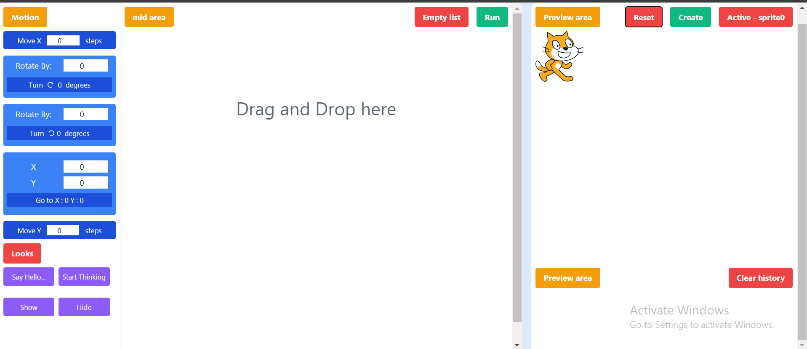

# Scratch Clone

Frontend Assignment, JUSPAY

## Introduction

Scratch Clone is a project aimed at replicating the fun and interactive motion features with a Sprite character. 

## Features

- Drag and drop motion blocks to create a motion script
- Play the motion script by clicking on run button
- Reorder the motion blocks in the script
- See the history of all the motion scripts created
- Create multiple Spites and run motion scripts on them
- Move Sprite in X direction
- Move Sprite in Y direction
- Rotate the Sprite in desired direction with given angle.
- Add looks to the Sprite which can make it say hello, start thinking, show and hide it.
- Change Sprite poition and send it anywhere on the screen

## NOTE

- The motion script can be created by dragging and dropping the motion blocks from the left panel to the mid panel.
- All the motions are implemented one by one(delay of 0.5sec) on the active Sprite.
- To change the active Sprite, choose the desired sprite from the dropdown in the preview area.
- At a time only one motion script can be created and run.
- The motion script can be run by clicking on the run button.
- Individual motion can be run and tested by clicking on the respective motion block.
- The motion script can be reordered by dragging and dropping the motion blocks in the mid panel.
- The history of all the motion scripts created can be seen in the right panel.
- You need to give an input to the motion block to see the implementation of motion.

## How to use

`npm install`
 
`npm start`

## Dependencies

- React JS
- React Beautiful DnD
- React Icons
- Redux Toolkit
- React Redux
- Tailwind CSS

## Screenshots

